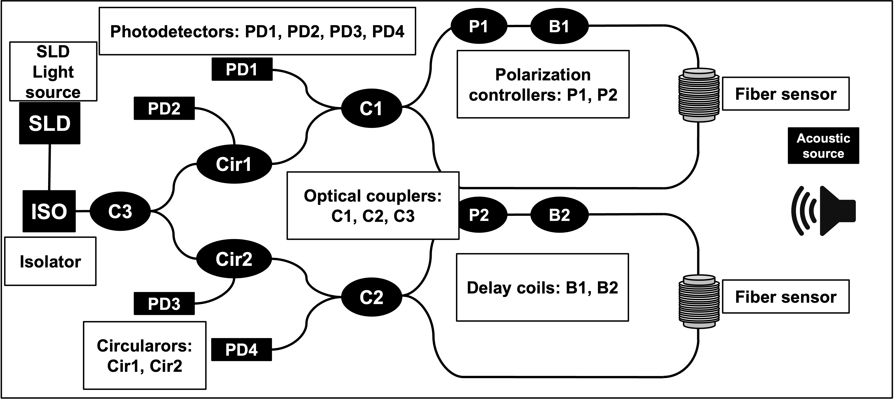
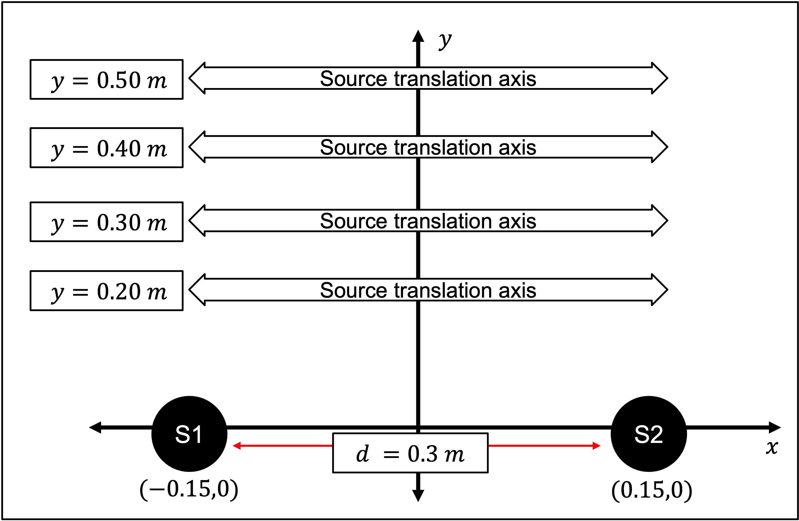
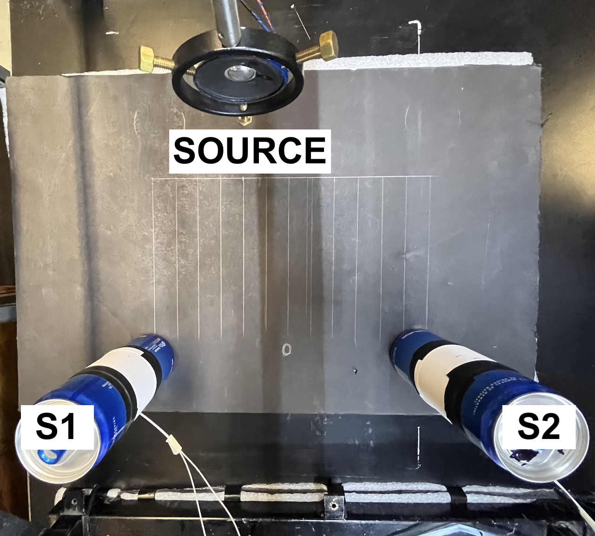
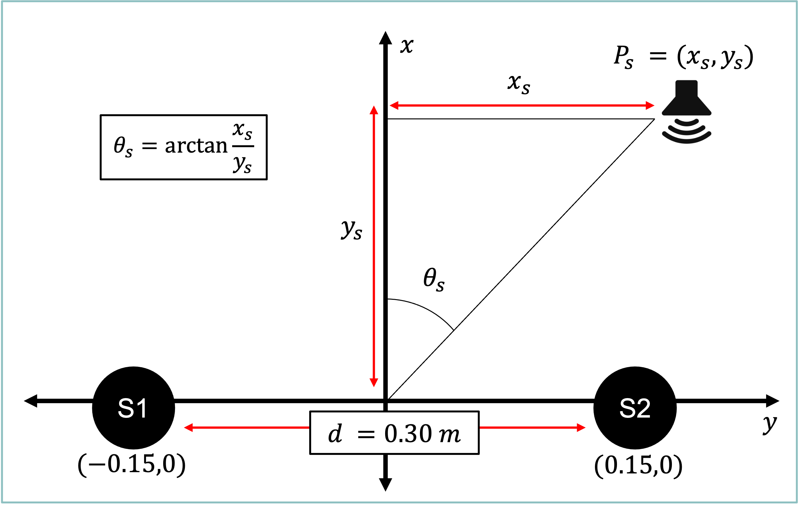
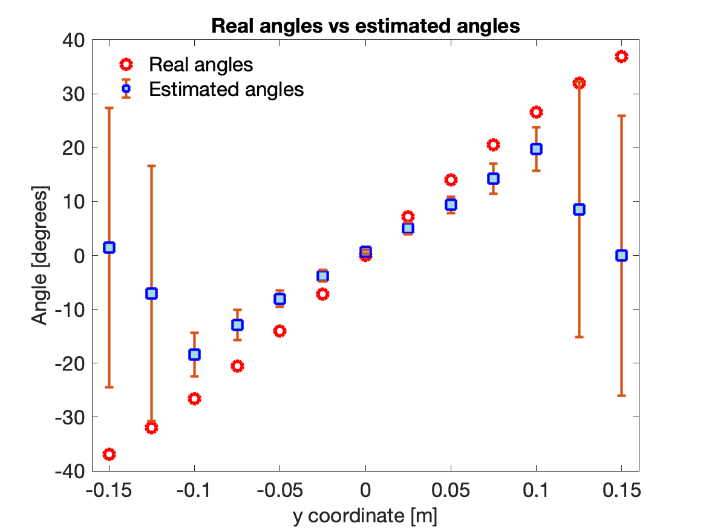
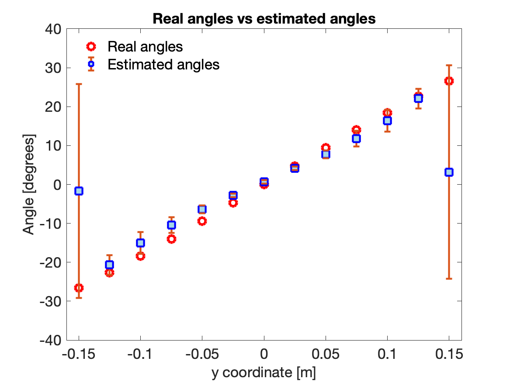
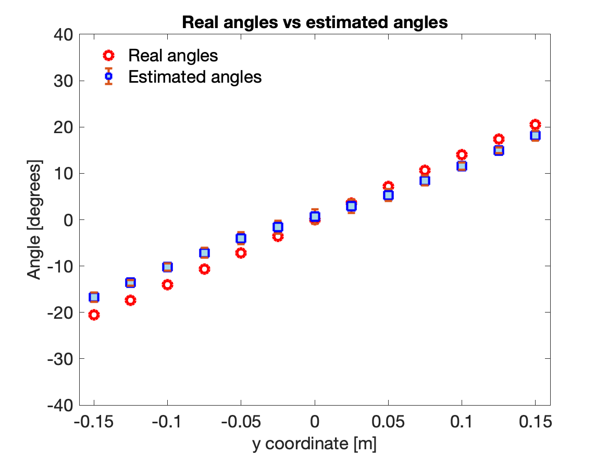
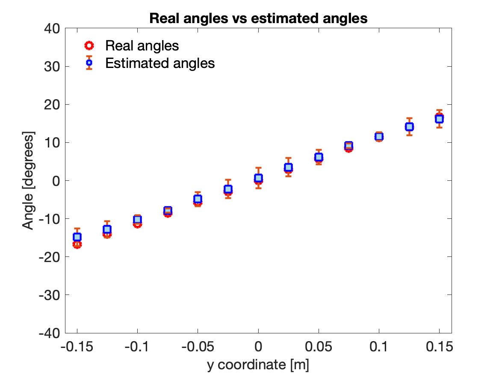

# Acoustic DOA Estimation using the CCV and MUSIC algotithms. 

## Table of Contents
- [Description](#description)
- [Project Overview](#projectoverview)
- [Methodology](#methodology)
- [Notebooks](#notebooks)
- [Datasets](#datasets)
- [Installation](#installation)
- [Requirements](#requirements)
- [Papers](#papers)
- [License](#license)

## Description 
This repository presents a complete and reproducible pipeline for
Direction of Arrival (DOA) estimation using acoustic signals acquired
from a fiber optic sensing system based on a Sagnac interferometer.

The design of the sensing system is shown in Figure 1.

**Figure 1:** *Acoustic sensing system based on the Sagnac interferometer in optical fiber.*

  
With this sensing system, the experimental design shown in Figure 2a is implemented. 
The experimental setup is shown in Figure 2b. 

 | 

**Figure 2a:** *Experimental design for measurements.* **Figure 2b:** *Experimental setup with sensors.*

  
The real angles of the are calculated as shown in Figure 3. 

**Figure 3:** *Real angles of the source.*

The results are shown in Figures

 | 

**Figure 4a.** *Results of CCV at 20cm.* **Figure 4a.** *Results of CCV at 30cm.*

 | 

**Figure 4c.** *Results of CCV at 40cm.* **Figure 4d.** *Results of CCV at 50cm.*

The project translates and extends MATLAB-based signal processing
algorithms into Python, integrating tools commonly used in Data Science
and Scientific Computing.

------------------------------------------------------------------------

## Project Overview

The goal of this project is to estimate the angle of arrival of an
acoustic source using experimental data and advanced signal processing
techniques.

Two main methods are implemented and compared:

-   CCV (Cross-Correlation Vector)
-   MUSIC (Multiple Signal Classification)

------------------------------------------------------------------------

## Methodology

CCV Method

-   FFT-based cross-correlation
-   Time-delay estimation
-   Angle reconstruction

MUSIC Algorithm

-   Covariance matrix estimation
-   Eigen decomposition
-   Noise subspace projection
-   Spectral peak detection

------------------------------------------------------------------------

## Notebooks

01_signal_loading_and_fft.ipynb

-   Load MATLAB data
-   Signal visualization
-   FFT analysis

02_doa_estimation_ccv_music.ipynb

-   Implementation of CCV and MUSIC
-   DOA estimation
-   Statistical analysis
-   Visualization with error bars

------------------------------------------------------------------------

## Dataset

-   1024 samples
-   13 positions
-   10 measurements
-   Distances: 0.2m, 0.3m, 0.4m, 0.5m

Structure: [samples, position, measurement]

------------------------------------------------------------------------

## Installation

git clone https://github.com/emilianounzueta/acoustic-doa-estimation.git

pip install -r requirements.txt

------------------------------------------------------------------------

## Requirements

numpy scipy matplotlib jupyter

------------------------------------------------------------------------

## Papers

This code is result of the article published in "Fiber and Integrated Optics "
journal.

> García-Unzueta, E.E.; Sandoval-Romero G. E.
> 
> Acoustic Sensor System for Estimating the Angle of Arrival
> of the Signal from a Source, Based on the Fiber Optic
> Sagnac Interferometer. Fiber and Integrated Optics
> Volume 44, 2025 - Issue 3
> 
> https://doi.org/10.1080/01468030.2025.2485871

------------------------------------------------------------------------

Author

Emiliano-Ehecatl García-Unzueta

------------------------------------------------------------------------

License

MIT
